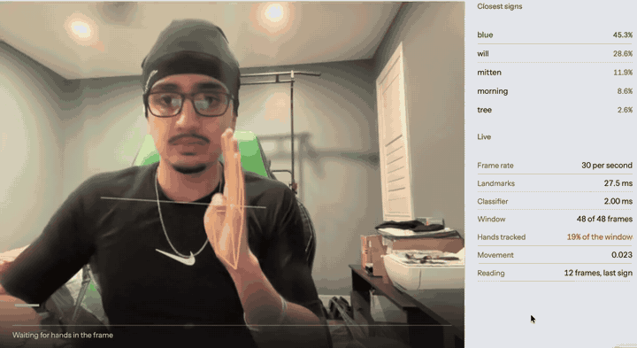
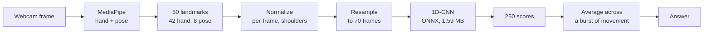

# Sign Recognition

Isolated sign language recognition from a webcam. MediaPipe landmark sequences feed a
temporal convolutional network, exported to ONNX and running live in the browser.

**[Try the live demo](https://ash-sid.github.io/sign-recognition/)** -- everything runs on
your machine; no video leaves the page.



**This is not translation.** It recognises individual signs in isolation. Grammar, spatial
referencing and non-manual markers are out of scope, which is why face landmarks are
excluded from the model input by design rather than by oversight.

Two deliverables of equal weight: a model with a real evaluation, and a demo that runs.

## Getting a good result from the demo

These eight are a fair sample of the 250, chosen because each has a large distinct
trajectory rather than a handshape held in one place. The figure is how often that sign was
read correctly on signers the model never trained on:

| | | | |
|---|---|---|---|
| `brown` 93% | `french fries` 91% | `cow` 89% | `airplane` 88% |
| `call on phone` 87% | `hello` 68% | `drink` 64% | `blue` 63% |

The last three miss regularly, and that is why they are on the list -- when they do, the
correct answer is usually still among the closest signs on the panel. A list of only the
reliable ones would advertise a model that does not exist.

The model learned each sign as its 21 signers performed it, and it is worth knowing where
that leaves it before you try:

- **Sign square to the camera.** Normalization removes your distance and position from the
  frame, but not your orientation. Turning your torso moves the reference the model
  measures against.
- **Keep your hands around shoulder height.** Height exists in the representation only as
  hand position relative to the shoulder line, so the learned range is narrow and literal.
- **Signs with a large, distinct trajectory work best.** Signs separated by fine handshape
  at a similar location usually land in the top five rather than first.
- **Sign with one hand.** Two-handed signs are recognised poorly, for a reason in the data
  rather than in the model: only 1.19% of test sequences have both hands tracked at all.
- **Watch the tracking readout.** The demo declines to answer below 50% hand presence
  across the window. Tracking quality is worth more than any modelling decision measured
  here, so a confident answer over a badly tracked window would be the most misleading
  thing the page could show.

The panel shows the thresholds and measurements the answer depends on, live.

## Results

Signer-independent split over 21 signers and 250 signs: 15 signers for training, 3 for
validation, 3 held out for test (14,015 sequences). No signer appears in more than one
split.

| Model | Test top-1 | Test top-5 |
|---|---|---|
| Majority class | 0.43% | -- |
| Logistic regression, mean-pooled landmarks | 26.71% | 52.80% |
| 1D-CNN, first working version | 48.69% | 75.78% |
| **1D-CNN, hands-only input, mirror augmentation** | **61.03%** | **82.59%** |

The last two rows were trained under different schedules and are not a before-and-after.
The gain came from protocol changes and input/augmentation ablations measured separately;
29 runs are recorded in [`reports/ablations.csv`](reports/ablations.csv), with the full
write-up in [`reports/results.md`](reports/results.md).

Fixing the training protocol mattered more than any individual ablation. Early stopping at
a constant learning rate was firing on validation noise: seed spread was 2.61pp, larger
than any effect the ablations were meant to measure. A cosine schedule over a fixed epoch
budget cut that fivefold, to 0.54pp.

A transformer encoder was tried and lost to the convolution by 7.1pp at matched settings,
overfitting on 67k sequences across 250 classes. It is recorded as a measured negative
result rather than dropped.

## How it works



Both hands plus eight upper-body pose points, no face. Normalization is per-frame
translation and scale taken from the shoulders, which is what makes the representation
invariant to how far from the camera a signer stands.

The model is three conv/BN/ReLU/maxpool blocks over time, then global average pooling, then
a linear classifier. The full input and output interface is specified in
[`reports/contract.md`](reports/contract.md).

**Why a convolution and not a recurrent model.** The CNN beats a GRU by 6.20pp across three
seeds each. A diagnostic explains it: a CNN trained *and* evaluated on randomly permuted
frames, structurally unable to use temporal order at all, still scores 47.68% against
54.83% ordered and 26.71% for a time-discarding baseline. So roughly 21pp of the lead comes
from the *distribution* of poses in a sequence and only about 7pp from their *order*. Most
of this task is order-independent, which suits convolution and leaves recurrence little to
do.

## What the evaluation controls for

- **A measured noise floor.** Differences below 0.7pp are not interpretable, established
  from three seeds of the reference configuration. Single-seed comparisons are not treated
  as evidence. The floor covers run-to-run retraining only: per-class accuracy carries
  about +/-13pp at 95% on ~57 test sequences per sign, which is why per-class results are
  reported as a distribution and never as a ranked worst-N table.
- **Per-prediction comparison, not just accuracy.** Two models can agree on a percentage
  while disagreeing about which sequences they get right. In one case a 0.01pp accuracy
  difference concealed 4.6% prediction-level change.
- **A flaw the evaluation found in itself.** All three test signers happen to place their
  dominant hand in the same slot, against a training majority using the other. A random
  draw lands that way about 4% of the time, and the split search optimised only for
  vocabulary coverage, so nothing checked. This inflates the measured benefit of mirror
  augmentation -- about 45% of that gain turns out to be slot-independence rather than
  augmentation -- and makes the test set harder than a representative one. It is documented
  rather than corrected, because redrawing the split would invalidate all 29 recorded runs.
  A second evaluation split should balance handedness as well as coverage.
- **Input quality separated from model quality.** Roughly 10pp of the gap to perfect
  accuracy is hand-tracking failure in the source data, not model capacity. Test accuracy
  runs 71.2% to 50.2% across increasing missing-frame rates on the tracked hand -- a 21pp
  spread, larger than architecture (6.2pp) or augmentation (4.7pp). 36.8% of the test split
  sits in the worst bucket.
- **Confusions that are structural, not arbitrary.** The top confusions are near-synonyms
  and minimal pairs: pen/pencil, lips/mouth, nap/sleep, cut/scissors, awake/wake,
  duck/goose. Five pairs recur in the top 15 of both validation and test. Pairs
  distinguished by non-manual markers are unrecognisable in principle here, since face
  landmarks are excluded by design.

## What deploying it taught

Three things the offline evaluation could not have surfaced, found only by pointing a
camera at the model:

**The classifier was evaluated on segmented sequences and deployed against an unsegmented
stream.** Every sequence in the dataset arrives pre-trimmed to one sign, so no evaluation
in the project had ever asked where a sign starts. Scoring a sliding window asks a question
that never appeared in training: what sign is this two seconds of video, most of which is
somebody standing still. The answer decays into whatever the pose held after a sign
resembles on its own -- which the shuffled-frame diagnostic predicts exactly, since most of
the task is solvable from the unordered collection of poses a window contains. Fixed by
scoring only while the hands are moving, averaging across each burst, and committing the
answer when the hands stop or leave the frame.

**The model learned each sign as its 21 signers performed it, not as a dictionary defines
it.** `hello` is recognised reliably near shoulder height and classified as `fireman` or
`pretend` -- both flat-hand-at-forehead signs -- when performed at true forehead height.
Reproducible across camera distances, so not a framing artifact. With no head landmark in
the representation, a sign's height exists only as hand position relative to the shoulder
line.

**Normalization removes distance and position from the camera, but not orientation.** The
shoulders it normalizes on are what rotates: turning the torso changes both the midpoint it
centres on and the width it scales by, moving the whole normalized frame underneath the
sign. All 21 signers were recorded facing the camera at consistent framing, so this is
variance the evaluation could not contain.

**Two-handed signs are unreachable, and the offline evaluation had already written down
why.** `finish` is read correctly on 53 of its 63 held-out test sequences, yet more than
forty live attempts never once put it in the top five. What came back was `mitten` almost
every time and `tree` occasionally -- which is precisely the model's own error distribution
for `finish`. Across its ten test errors, `tree` appears at 72 times its base rate as an
answer and `mitten` at 20 times, while the two otherwise share a top-5 only 4% of the time.
A different signer on different hardware reproduced the model's error basin without ever
reaching the sign. The cause is in the data: only 1.19% of test sequences have both hands
tracked, so a sign performed with two hands is an input the model has almost no training
for.

That last one is the useful one. The other three are places the offline evaluation was
structurally blind. This one it had already measured: the per-class confusion structure,
reported as a distribution precisely because ranked worst-N tables rank sampling noise,
turned out to predict which signs a live signer cannot reach and where the attempts land
instead. Nobody read it that way until a camera was pointed at the model.

None of these are visible in an accuracy number, and all four change what the project can
honestly claim.

## Deployment

[`models/abl_hands_aug.onnx`](models/) -- float32, opset 18, self-contained, 1.59 MB
(1.46 MB gzipped). Takes the full `(batch, 70, 50, 3)` landmark tensor; the landmark-subset
slice and the flatten live inside the graph, so a consumer implements
[`reports/contract.md`](reports/contract.md) and nothing more. The export reproduces all
14,015 stored predictions exactly on the same device.

The TypeScript preprocessing port is checked **bit-exact** against the Python
implementation, tolerance zero, over 13 fixture cases including 4 recorded test sequences.
Nothing else in the project fails when the two drift apart: both sides produce a tensor of
the right shape full of plausible numbers, and the only symptom is a demo quietly worse
than the accuracy it advertises.

| | Native | In the browser |
|---|---|---|
| Classifier, one sequence | 0.27 ms | ~1.5 ms |
| Preprocessing, one frame | -- | 0.65-0.9 ms |
| Graph download | 1.46 MB gzipped | 1.46 MB gzipped |
| Runtime download | -- | 3.65 MB gzipped |
| Live frame rate | -- | 29-30 per second |

**INT8 quantization was measured across four variants and rejected.** It saves about 1.1 MB
compressed, but moves 3.77% of individual predictions for 0.18pp of accuracy, and inference
cost was never the constraint. Dynamic quantization is *slower* than float32 on a model
this small. The browser build settles it: the runtime alone is 3.65 MB gzipped against the
graph's 1.46 MB, so the rejected saving is about a fifth of what a visitor downloads either
way -- not worth disagreeing with every published number on one sequence in twenty-seven.

## Stack

- **Training:** Python 3.11, PyTorch (CUDA), `uv` for environment management
- **Data:** Google Isolated Sign Language Recognition (Kaggle `asl-signs`) -- pre-extracted
  MediaPipe landmarks, 94,477 sequences, 21 signers, 250 signs
- **Export:** ONNX, ONNX Runtime, opset 18
- **Front-end:** Vite + TypeScript, MediaPipe Tasks, `onnxruntime-web` (plain WebAssembly
  build, single-threaded)

## Layout

```
src/        preprocessing, training, evaluation, export
tests/      dry-run harnesses on synthetic data
reports/    results, preprocessing contract, per-run configs, per-sequence predictions
models/     the trained checkpoint and the exported graph
web/        the browser app and its parity fixture
data/       split definition (raw data and cache are not committed)
```

## Running it

Training and evaluation require the Kaggle dataset under `data/raw/`.

```powershell
uv pip install -r requirements.txt

uv run python src\cache_dataset.py
uv run python src\train.py --model cnn --landmarks hands --augment --lr-schedule cosine --epochs 120 --run-name abl_hands_aug
uv run python src\evaluate.py --run-name abl_hands_aug --split test
uv run python src\export_onnx.py --run-name abl_hands_aug
```

The CUDA build of PyTorch needs an explicit index URL; see the comment above `torch` in
`requirements.txt`. A plain install pulls the CPU-only build.

Tests run on synthetic data and need no dataset:

```powershell
uv run python tests\test_transforms.py
uv run python tests\dryrun_eval.py
uv run python tests\dryrun_export.py
```

The browser app reads the graph and the label list from `models/`, one directory up, so it
must be run from inside a full checkout. A camera needs a secure context, which `localhost`
provides.

```powershell
cd web
npm install
npm run dev
```

## Limitations

- **Recognition of isolated signs, not translation.**
- **250 signs** is a fixed vocabulary and small next to any real signing repertoire.
- **21 signers, all recorded in similar conditions.** Lighting, framing and distance
  variation in real use are not represented in the evaluation.
- **The test split is handedness-confounded**, which inflates the measured augmentation
  gain and makes the test set harder than a representative one. Documented, not corrected.
- **About 10pp of headroom is hand-tracking quality** in the source data rather than
  modelling. Whether better extraction settings recover any of it is untested and outside
  a pipeline that consumes pre-extracted landmarks.
- **Orientation is not normalized away**, and neither is sign height relative to the head.
  Both were found live, not offline.
- **Two-handed signs are effectively out of reach.** 97.4% of sequences are one-handed and
  no sign exceeds 12% two-handed, so the label records what the extraction pipeline tracked
  rather than how the sign is performed. There is no contrast in the data to learn from.
- **Mirroring changes 4.6% of individual predictions** at the same accuracy, so a mirrored
  camera feed disagrees with an unmirrored one about one sequence in twenty-two. The demo
  scores the camera's own view and exposes the choice as a control.
- **The demo depends on two third-party origins** for the MediaPipe runtime and landmark
  models. The classifier and its runtime are served from this site.
- **The window length is reasoned, not measured.** 48 frames follows from the dataset's
  median sequence length of about 22, and one person signing cannot settle it.
