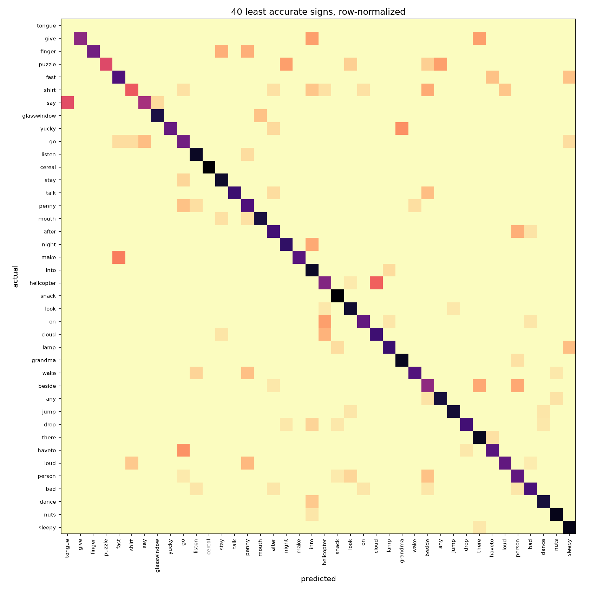

<!-- ERROR_ANALYSIS_VAL_START -->
## Error analysis

`abl_hands_aug` on the val split: 58.18% top-1 (95% CI 57.33%-59.02%), 80.85% top-5, over 13075 sequences from 3 signers.

### Which hand the data is in

| Split | Left slot | Mixed | Right slot |
|---|---|---|---|
| train | 4 | 1 | 10 |
| val | 1 | 0 | 2 |
| test | 3 | 0 | 0 |

Each signer's one-handed sequences overwhelmingly put the active hand in the same block, so the block is a stable property of a signer. The training and evaluation splits do not draw from the same mixture of them.

This describes the recording, not the signer. MediaPipe assigns left and right from the camera's point of view, so a left-handed signer and a right-handed one captured in a mirrored frame are indistinguishable here. The model only ever sees which block is filled, so the distinction does not change anything below.

### Tracking quality

| Frames missing on the tracked hand | Sequences | Top-1 | 95% CI |
|---|---|---|---|
| <10% | 2800 | 68.04% | 66.28%-69.74% |
| 10-25% | 2124 | 67.89% | 65.87%-69.84% |
| 25-50% | 3557 | 60.64% | 59.02%-62.23% |
| >50% | 4594 | 45.78% | 44.34%-47.22% |

The landmark files are not uniformly complete, and the model's input does not record how much of a sequence was interpolated rather than observed.

### Sequence length

| Frames before resampling | Sequences | Top-1 | 95% CI |
|---|---|---|---|
| <=22 | 6037 | 51.70% | 50.44%-52.96% |
| 23-70 | 5001 | 62.97% | 61.62%-64.30% |
| 71-135 | 1060 | 68.87% | 66.02%-71.58% |
| >135 | 977 | 62.13% | 59.05%-65.12% |

Sequences longer than the resampling target have frames discarded; shorter ones are interpolated up. Signing tempo varies by signer, so a length effect and a signer effect are easy to confuse -- the per-signer breakdown is in the accompanying CSV.

### One- and two-handed signs

This split has 156 sequences (1.19%) in which both hands were detected, and no sign reaches 28% two-handed sequences (median 0.0%). Signs that are two-handed when performed are not two-handed in this data: the non-dominant hand is rarely tracked. Whether the model handles two-handed signs worse cannot be answered from these landmarks, because there is almost no contrast to measure.

### Which signs collide

| Actual | Confused with | -> | <- | Combined rate |
|---|---|---|---|---|
| awake | wake | 15 | 28 | 75.4% |
| glasswindow | tooth | 23 | 1 | 49.7% |
| goose | tongue | 0 | 19 | 47.5% |
| duck | goose | 17 | 7 | 46.4% |
| lamp | shhh | 19 | 0 | 46.3% |
| hear | listen | 2 | 31 | 44.2% |
| boat | there | 12 | 10 | 43.9% |
| cereal | grass | 15 | 2 | 41.3% |
| penny | think | 14 | 6 | 37.3% |
| same | stay | 2 | 17 | 36.8% |
| chin | say | 3 | 16 | 36.8% |
| pen | pencil | 6 | 14 | 36.3% |
| ear | hear | 0 | 25 | 35.7% |
| look | see | 25 | 0 | 35.2% |
| cat | kitty | 11 | 7 | 33.9% |

Ranked by the two conditional error rates summed, so a pair appears for being mutually confusable rather than for being common. 11 of 15 are confused in both directions.

The model sees hand landmarks only. Face and lip landmarks are excluded by design, so any pair of signs distinguished mainly by mouth shape or other non-manual markers is not separable by this model in principle rather than merely in practice.

### Per-class accuracy

Across 250 signs: min 0.00%, lower quartile 45.13%, median 60.36%, upper quartile 72.88%, max 98.28%. 1 signs are never predicted correctly.

These are not ranked, deliberately. The median sign has 53 sequences in this split, so a sign scoring 60% carries a 95% interval of roughly 46.94%-72.41%. A table of the worst individual signs would mostly be reporting which classes got an unlucky draw, and would not reproduce on another test set. Per-sign numbers are in the accompanying CSV for anyone who wants them with that caveat attached.

<!-- ERROR_ANALYSIS_VAL_END -->
