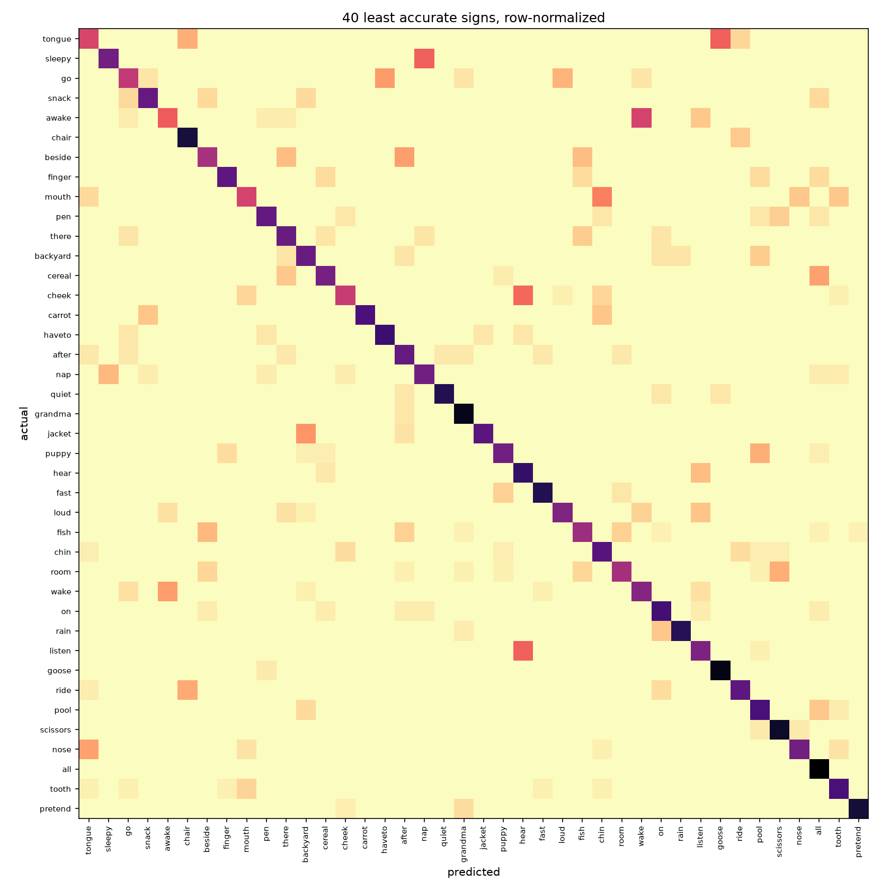

# Results

Recognizing 250 isolated American Sign Language signs from webcam video. Each
example is one person performing one sign; the model reads the sequence of hand
landmark positions MediaPipe extracts from the video and predicts which sign it
was. The dataset is 94,477 sequences from 21 signers.

**The production model gets 61.0% of held-out sequences right on its first guess
and 82.6% within its top five, on three signers it never saw during training.**
It classifies a sequence in 0.6 ms on one CPU thread.

Two things matter more for reading that number than the number itself. Roughly
ten points of the gap to perfect accuracy is not the model at all -- it is
sequences where MediaPipe never got a good look at the hand, and the model
scores 71% where tracking is clean against 50% where more than half the frames
are missing. And the three test signers all sign with the opposite hand to the
training majority, which is an accident of how the split was drawn and which
inflates part of what is reported below as a modelling gain. Both are measured
rather than estimated, in the error analysis section.

This file is the record of how that model was arrived at: what was tried, what
was measured, and which conclusions the measurements do and do not support.

<!-- BASELINES_START -->
# Results

## Split (data/splits.json)
- train signers: 15 (67022 sequences)
- val signers: 3 (13075 sequences)
- test signers: 3 (14015 sequences)
- vocabulary: 250 signs

## Baselines

| Model | Val top-1 | Test top-1 | Val top-5 | Test top-5 |
|---|---|---|---|---|
| Majority class | 0.0041 | 0.0043 | — | — |
| Logistic regression (mean-pooled landmarks) | 0.2495 | 0.2671 | 0.5034 | 0.5280 |

Logistic regression fit time: 40.2s.

Any subsequent temporal model needs to clear the logistic-regression test
top-1 number above to be worth the added complexity over mean-pooling.

<!-- BASELINES_END -->

<!-- RUNS_START -->
## Models

| Run | Model | Landmarks | Normalized | Augment | Notes | Seed | Best epoch | Val top-1 | Test top-1 | Test top-5 | Train s |
|---|---|---|---|---|---|---|---|---|---|---|---|
| v1_gru | gru | hands_pose | true | false | — | 0 | 41 | 0.4938 | 0.4687 | 0.7244 | 99 |
| v1_cnn | cnn | hands_pose | true | false | — | 0 | 19 | 0.5162 | 0.4869 | 0.7578 | 65 |
| v1_cnn_s1 | cnn | hands_pose | true | false | — | 1 | 40 | 0.5299 | 0.5315 | 0.7855 | 111 |
| v1_cnn_s2 | cnn | hands_pose | true | false | — | 2 | 51 | 0.5302 | 0.5328 | 0.7851 | 137 |
| v1_gru_s1 | gru | hands_pose | true | false | — | 1 | 56 | 0.4922 | 0.4920 | 0.7413 | 123 |
| v1_gru_s2 | gru | hands_pose | true | false | — | 2 | 20 | 0.4776 | 0.4634 | 0.7232 | 59 |
| ref_cnn_s0 | cnn | hands_pose | true | false | cosine LR | 0 | 60 | 0.5429 | 0.5483 | 0.7907 | 135 |
| ref_cnn_s1 | cnn | hands_pose | true | false | cosine LR | 1 | 47 | 0.5399 | 0.5376 | 0.7873 | 133 |
| ref_cnn_s2 | cnn | hands_pose | true | false | cosine LR | 2 | 52 | 0.5412 | 0.5418 | 0.7862 | 133 |
| ref_gru_s0 | gru | hands_pose | true | false | cosine LR | 0 | 47 | 0.4886 | 0.4890 | 0.7372 | 114 |
| ref_gru_s1 | gru | hands_pose | true | false | cosine LR | 1 | 31 | 0.4847 | 0.4763 | 0.7300 | 116 |
| ref_gru_s2 | gru | hands_pose | true | false | cosine LR | 2 | 31 | 0.4890 | 0.4765 | 0.7314 | 114 |
| abl_hands_only | cnn | hands | true | false | cosine LR | 0 | 56 | 0.5469 | 0.5562 | 0.7894 | 135 |
| abl_no_norm | cnn | hands_pose | false | false | cosine LR | 0 | 60 | 0.5318 | 0.5400 | 0.7815 | 132 |
| abl_augment | cnn | hands_pose | true | true | cosine LR | 0 | 59 | 0.5686 | 0.5936 | 0.8141 | 161 |
| v2_transformer | transformer | hands_pose | true | false | adamw, cosine LR | 0 | 25 | 0.4783 | 0.4770 | 0.7443 | 429 |
| v2_transformer_aug | transformer | hands_pose | true | true | adamw, cosine LR | 0 | 43 | 0.4938 | 0.5239 | 0.7638 | 463 |
| diag_gru_meanpool | gru | hands_pose | true | false | mean pooling, cosine LR | 0 | 50 | 0.4857 | 0.4901 | 0.7480 | 132 |
| diag_shuffled | cnn | hands_pose | true | false | frames shuffled, cosine LR | 0 | 54 | 0.4596 | 0.4768 | 0.7573 | 150 |
| abl_augment_long | cnn | hands_pose | true | true | cosine LR | 0 | 92 | 0.5798 | 0.5966 | 0.8118 | 373 |
| abl_hands_aug | cnn | hands | true | true | cosine LR | 0 | 116 | 0.5818 | 0.6103 | 0.8259 | 351 |
| prod_s1 | cnn | hands_pose | true | true | cosine LR | 1 | 120 | 0.5793 | 0.5983 | 0.8223 | 416 |
| prod_s2 | cnn | hands_pose | true | true | cosine LR | 2 | 109 | 0.5722 | 0.5947 | 0.8186 | 380 |
| prod_hands_s1 | cnn | hands | true | true | cosine LR | 1 | 105 | 0.5726 | 0.6036 | 0.8254 | 374 |
| prod_hands_s2 | cnn | hands | true | true | cosine LR | 2 | 104 | 0.5777 | 0.6054 | 0.8233 | 364 |
| abl_mirror_only | cnn | hands | true | true | mirror only, cosine LR | 0 | 104 | 0.5736 | 0.6025 | 0.8225 | 307 |
| abl_warp_only | cnn | hands | true | true | warp only, cosine LR | 0 | 109 | 0.5594 | 0.5666 | 0.7955 | 314 |
| abl_jitter_only | cnn | hands | true | true | jitter only, cosine LR | 0 | 116 | 0.5507 | 0.5633 | 0.7976 | 286 |
| abl_hands_only_long | cnn | hands | true | false | cosine LR | 0 | 116 | 0.5550 | 0.5633 | 0.7932 | 299 |

One row per training run. `Landmarks` is either both hands plus the eight pose
points (`hands_pose`) or the hands alone (`hands`); `Normalized` is whether the
shoulder-relative normalization was applied during preprocessing; `Augment` is
whether training batches were mirrored, time-warped and jittered. `Notes` covers
anything else a run varied. The full per-run configuration, including fields not
shown here, is in reports/ablations.csv.

A model has to clear the mean-pooled logistic regression's test top-1 of 0.2671
to be worth its added complexity over ignoring time entirely.

<!-- RUNS_END -->

## Reading these results

### Protocol

All numbers are on the signer-independent split (15 train / 3 val / 3 test signers) in
`data/splits.json`. Test scores are on three signers the model never saw.

**Noise floor: 0.7pp.** Three seeds of the best configuration gave a standard deviation
of 0.35pp, so differences below roughly 0.7pp (2 sd) are not interpretable and are
described as "within noise" throughout.

That floor applies to comparisons between training runs and to nothing else. Per-class
accuracy in the error analysis is a separate quantity with its own, much larger
uncertainty: at roughly 57 test sequences per sign, a single sign's accuracy carries a
95% interval near +/-13pp.

**The split has a confound that was found late and is not corrected.** Signers are
consistent about which of the two hand slots their dominant hand occupies, and the
splits do not draw from the same mixture: training is 10 right-slot signers to 4
left-slot with one mixed, while all three test signers are left-slot. A random 3-signer
test set lands that way about 4% of the time, and the split search optimized only for
sign-vocabulary coverage, so nothing checked for it. The split is therefore
signer-independent *and* handedness-shifted, and the two cannot be separated. The
consequence is quantified under augmentation below. It is documented rather than fixed
because redrawing the split would invalidate the comparability of every run in the
table.

Two training protocols appear in the table and **should not be compared across**:

- **Constant learning rate, early stopping at patience 10.** The earliest runs. Val
  top-1 is noisy enough epoch-to-epoch that early stopping fired on jitter rather than
  on exhausted progress, truncating runs at effectively random points. Across three
  seeds this produced a 4.6pp spread, and within each architecture the run that
  survived longest scored highest without exception.
- **Cosine-annealed learning rate over a fixed budget, early stopping disabled**
  (`cosine LR` in the Notes column). Every run reaches the same convergence point.
  Seed spread fell roughly fivefold, and mean accuracy rose 2.6pp.

The second protocol is the one to use. The first is retained because the earliest rows
document reproducing an earlier result.

### Landmark set and normalization

**Hands only beats hands plus pose by 0.99pp** (three seeds each, Welch t = 4.39,
df = 3.0, p ~ 0.02). Small but real. A plausible reading is that elbow and hip
positions are more signer-specific than hand shape, so including them invites
overfitting to the fifteen training signers — but that is a hypothesis, not something
these runs establish.

This does **not** mean the pose landmarker can be dropped from the inference pipeline.
Normalization uses the shoulders, so those points are still required upstream; only the
model's input is narrower.

**Removing normalization costs 0.83pp, which is within noise — and this should not be
read as "normalization is unnecessary."** Every signer in this dataset was recorded in
similar framing at a similar distance from the camera, so there is little positional
variance for normalization to remove and little for the model to gain from it. A webcam
user standing closer, further away, or off to one side is precisely the case
normalization handles and precisely the case this dataset does not contain. The result
says the evaluation lacks the variation, not that the method is useless.

### Augmentation is mirroring, and mirroring is two things

Augmentation is the single largest training effect in the table at +4.69pp. Decomposed
against a matched unaugmented baseline, each transform run alone:

| Transform | Test top-1 | vs unaugmented |
|---|---|---|
| Horizontal mirror | 0.6025 | +3.92pp |
| Time warp | 0.5666 | +0.33pp (within noise) |
| Landmark jitter | 0.5633 | +0.00pp (within noise) |

Mirroring alone is statistically indistinguishable from all three combined. Time warp
and landmark jitter contribute nothing measurable.

*Why* mirroring helps was tested directly rather than assumed, by scoring both models a
second time on a mirrored copy of the test set. Mirroring a sequence is a valid
re-performance of the same sign by someone whose dominant hand is the other one, so a
model that has not keyed on which hand slot is filled should score the same either way.

- The **unaugmented** model improves by 2.10pp when the test set is mirrored, and
  36.7% of its predictions change. It scores *better* on flipped input, which is only
  possible if the test signers occupy the opposite slot from the training majority —
  reflecting them makes them look like the training data.
- The **augmented** model moves by 0.01pp (142 sequences lost, 143 gained, p = 1), with
  4.6% of predictions changing. It is very close to indifferent to the slot.

So mirroring buys two separable things. Aligning the unaugmented model's input with the
slot it was trained on recovers 2.10pp of the 4.69pp, meaning **roughly 45% of the
augmentation gain is the model no longer depending on which hand slot the data is in,
and the remaining 55% is augmentation acting as ordinary augmentation.** Both halves are
real, but only the second would survive on an evaluation split whose handedness mixture
matched training. An earlier draft of this file attributed the whole effect to
handedness; that was an untested hypothesis and it was about half right.

The 4.6% residual prediction churn also matters downstream: a live demo fed a mirrored
camera image will return a different answer for about one sequence in twenty-two.

### Why the 1D-CNN beats the GRU

The convolutional model leads the recurrent one by 6.20pp (three seeds each,
Welch t = 11.85). Three candidate explanations were tested and rejected:

- **Learning-rate schedule.** Cosine annealing *widened* the gap rather than closing it,
  giving the CNN +2.6pp and the GRU +0.6pp.
- **Seed variance.** At three seeds per architecture under the stable protocol, t = 11.85.
- **Sequence pooling.** The GRU summarized sequences with its last hidden state while the
  CNN used global average pooling. Switching the GRU to mean pooling moved it 0.11pp.

The `frames shuffled` row explains it instead. A CNN trained and evaluated on randomly
permuted frames — unable to use temporal order at all — still reaches 0.4768, against
0.5483 with frames in order and 0.2671 for a logistic regression on mean-pooled
landmarks that discards the time axis entirely. That splits the gap: roughly 21pp comes
from seeing the *distribution* of poses in a sequence rather than their average, and
only about 7pp from their *order*.

Most of this task is order-independent. A convolutional stack followed by global average
pooling is close to a purpose-built extractor for an unordered collection of local
patterns, while a recurrent model's sequential state has comparatively little to do.

### The transformer

A four-layer transformer encoder at matched dropout reaches 0.4770, 7.1pp below the CNN,
and overfits: final training loss 0.3850 against the CNN's 0.6254, with validation
peaking at epoch 25 and declining thereafter. Augmentation recovers 4.7pp but leaves it
2.4pp short, at 3.2x the training time.

67k sequences across 250 classes is not enough data for attention to overcome a
convolution's inductive bias here. The transformer is kept in the table as a measured
negative result, not adopted.

### What actually limits accuracy

The full breakdown is in the error analysis below; the short version is that the two
largest effects on whether a sequence is classified correctly are properties of the
input, not choices about the model.

**Hand tracking quality dominates everything.** Accuracy runs from 71.2% on sequences
where the tracked hand is detected in almost every frame down to 50.2% where more than
half the frames are missing — a 21pp spread, larger than any architecture or training
decision in this project. 36.8% of the test split falls in that worst bucket. If every
sequence were tracked as cleanly as the best bucket, test top-1 would be around 71%
rather than 61%. The same pattern holds on the validation split, so it is not a quirk of
one set of signers.

**Short sequences are hard and cannot be fixed by resampling.** Accuracy is 57.1% on
sequences of 22 frames or fewer, which are 39% of the test split, against about 65% in
the middle of the range. This is not the tracking effect in disguise: length and
missing-frame rate are only weakly correlated (Spearman 0.04 on test, 0.12 on
validation) and in the opposite direction, so short sequences are tracked *better* and
still score lower. Upsampling cannot recover information the camera never captured.

Accuracy also falls to 52.9% above 135 frames, where resampling discards more than half
the frames — but that bucket is 6.9% of the split, so raising the resampling target
would buy under a point while doubling the model's input length. The target stays at 70.

**Some of the remaining error looks irreducible.** The signs the model confuses are
overwhelmingly near-synonyms and minimal pairs: pen/pencil, lips/mouth, nap/sleep,
cut/scissors, awake/wake, duck/goose. Five pairs appear in the top fifteen of both the
validation and test splits, so these are properties of the sign pairs rather than
sampling noise, and 14 of the 15 test pairs are confused in both directions. The model
sees hand landmarks only — face and lip landmarks are excluded by design — so any pair
distinguished mainly by mouth shape or another non-manual marker is not separable by
this model in principle rather than merely in practice.

### Best model

`abl_hands_aug` — 1D-CNN, hands-only input, mirrored/warped/jittered training batches,
120 epochs on a cosine schedule. **Test top-1 61.03%, test top-5 82.59%**, at 0.39M
parameters and 0.60 ms per sequence on a single CPU thread.

It is also the best of its three seeds by *validation* top-1 (0.5818 against 0.5726 and
0.5777), so the selection did not use the test set.

Read that 61.03% with two qualifications. It is measured on a test set whose signers all
occupy the opposite hand slot from the training majority, which makes it a harder
evaluation than a representative one would be and which inflates the measured value of
augmentation. And roughly ten points of the shortfall from perfect accuracy is attributable
to sequences MediaPipe tracked poorly, which no change to this model would recover.

<!-- ERROR_ANALYSIS_TEST_START -->
## Error analysis

`abl_hands_aug` on the test split: 61.03% top-1 (95% CI 60.22%-61.83%), 82.59% top-5, over 14015 sequences from 3 signers.

### Which hand the data is in

| Split | Left slot | Mixed | Right slot |
|---|---|---|---|
| train | 4 | 1 | 10 |
| val | 1 | 0 | 2 |
| test | 3 | 0 | 0 |

Each signer's one-handed sequences overwhelmingly put the active hand in the same block, so the block is a stable property of a signer. The training and evaluation splits do not draw from the same mixture of them.

This describes the recording, not the signer. MediaPipe assigns left and right from the camera's point of view, so a left-handed signer and a right-handed one captured in a mirrored frame are indistinguishable here. The model only ever sees which block is filled, so the distinction does not change anything below.

Scoring the same sequences mirrored moves top-1 by +0.01pp (61.03% to 61.03%). 142 sequences are lost and 143 gained, exact binomial p = 1. 4.62% of top-1 predictions change.

Against `abl_hands_only_long`, which is identical but trained without augmentation: mirroring moves that model by +2.10pp (56.33% to 58.43%), and 36.68% of its predictions change.

Augmentation is worth +4.69pp here. Aligning the unaugmented model's input with the block it was trained on recovers 2.10pp of that, so roughly 45% of the gain is the model no longer depending on which block the data is in, and the remaining 2.60pp is augmentation acting as augmentation. Both halves are real; only the first would shrink on an evaluation split that matched the training mixture.

### Tracking quality

| Frames missing on the tracked hand | Sequences | Top-1 | 95% CI |
|---|---|---|---|
| <10% | 3224 | 71.18% | 69.60%-72.72% |
| 10-25% | 2105 | 67.32% | 65.28%-69.29% |
| 25-50% | 3533 | 63.83% | 62.23%-65.40% |
| >50% | 5153 | 50.18% | 48.82%-51.55% |

The landmark files are not uniformly complete, and the model's input does not record how much of a sequence was interpolated rather than observed.

### Sequence length

| Frames before resampling | Sequences | Top-1 | 95% CI |
|---|---|---|---|
| <=22 | 5522 | 57.12% | 55.81%-58.42% |
| 23-70 | 4947 | 64.91% | 63.57%-66.23% |
| 71-135 | 2575 | 65.01% | 63.15%-66.83% |
| >135 | 971 | 52.94% | 49.79%-56.06% |

Sequences longer than the resampling target have frames discarded; shorter ones are interpolated up. Signing tempo varies by signer, so a length effect and a signer effect are easy to confuse -- the per-signer breakdown is in the accompanying CSV.

### One- and two-handed signs

This split has 169 sequences (1.21%) in which both hands were detected, and no sign reaches 19% two-handed sequences (median 0.0%). Signs that are two-handed when performed are not two-handed in this data: the non-dominant hand is rarely tracked. Whether the model handles two-handed signs worse cannot be answered from these landmarks, because there is almost no contrast to measure.

### Which signs collide

| Actual | Confused with | -> | <- | Combined rate |
|---|---|---|---|---|
| pen | pencil | 16 | 16 | 50.8% |
| duck | tongue | 0 | 28 | 49.1% |
| lips | mouth | 8 | 20 | 45.9% |
| duck | goose | 8 | 19 | 45.5% |
| animal | have | 6 | 16 | 44.9% |
| stay | that | 16 | 9 | 42.4% |
| finger | wait | 14 | 8 | 39.0% |
| nap | sleep | 14 | 7 | 37.3% |
| glasswindow | tooth | 8 | 13 | 34.4% |
| cut | scissors | 9 | 10 | 34.0% |
| dirty | pig | 2 | 16 | 32.9% |
| cloud | rain | 5 | 13 | 32.3% |
| chin | say | 10 | 8 | 32.1% |
| awake | wake | 11 | 7 | 31.7% |
| chair | read | 14 | 1 | 29.9% |

Ranked by the two conditional error rates summed, so a pair appears for being mutually confusable rather than for being common. 14 of 15 are confused in both directions.

The model sees hand landmarks only. Face and lip landmarks are excluded by design, so any pair of signs distinguished mainly by mouth shape or other non-manual markers is not separable by this model in principle rather than merely in practice.

### Per-class accuracy

Across 250 signs: min 8.77%, lower quartile 48.09%, median 62.84%, upper quartile 73.72%, max 96.49%. 0 signs are never predicted correctly.

These are not ranked, deliberately. The median sign has 57 sequences in this split, so a sign scoring 60% carries a 95% interval of roughly 46.70%-71.38%. A table of the worst individual signs would mostly be reporting which classes got an unlucky draw, and would not reproduce on another test set. Per-sign numbers are in the accompanying CSV for anyone who wants them with that caveat attached.

<!-- ERROR_ANALYSIS_TEST_END -->

<!-- LATENCY_START -->
## Inference latency

`abl_hands_aug` classifying one sequence on the CPU, batch size 1, input (1, 70, 126), 0.39M parameters. 300 timed calls after 30 discarded warmup calls, on AMD64 Family 25 Model 33 Stepping 0, AuthenticAMD.

| Threads | Median | p95 | p99 | Min | Max |
|---|---|---|---|---|---|
| 1 | 0.60 ms | 0.72 ms | 0.78 ms | 0.59 ms | 0.80 ms |
| 8 (default) | 0.44 ms | 0.52 ms | 0.58 ms | 0.37 ms | 0.74 ms |

Single-threaded is the number to plan against. It is the conservative bound and the closer analogue of a browser, which will not hand one inference every core on the machine.

At 20 FPS the whole pipeline has 50 ms per frame. The model forward pass uses 1.2% of that single-threaded at the median. The remainder covers landmark extraction, which is expected to dominate, so this figure shows the classifier is not the constraint rather than showing the pipeline will hold.

Measured through PyTorch on the CPU. The browser will run a different runtime on different hardware, so treat this as a reference point for the model's cost, not as a prediction of what the demo will do.

<!-- LATENCY_END -->

<!-- EXPORT_START -->
## Export and quantization

`abl_hands_aug` exported to ONNX and quantized, scored on the test split (14015 sequences). Sizes are of the graph file, which carries its own weights. Timings are single-threaded on AMD64 Family 25 Model 33 Stepping 0, AuthenticAMD: 300 calls at batch size 1 after 30 discarded, and 20 runtime constructions.

| Variant | Size | Gzipped | Load | Inference (median) | Inference (p95) | Top-1 | Top-5 | Predictions changed | p |
|---|---|---|---|---|---|---|---|---|---|
| `fp32` | 1.59 MB | 1.46 MB | 1.7 ms | 0.27 ms | 0.28 ms | 61.03% | 82.59% | — | — |
| `int8_dynamic` | 0.42 MB | 0.26 MB | 3.4 ms | 3.04 ms | 3.07 ms | 60.51% | 82.37% | 992 (7.08%) | 0.000436 |
| `int8_dynamic_conv_only` | 0.61 MB | 0.44 MB | 2.9 ms | 3.02 ms | 3.11 ms | 60.51% | 82.34% | 973 (6.94%) | 0.000291 |
| `int8_static` | 0.43 MB | 0.32 MB | 3.5 ms | 0.12 ms | 0.15 ms | 60.85% | 82.58% | 529 (3.77%) | 0.101 |
| `int8_static_conv_only` | 0.62 MB | 0.50 MB | 3.6 ms | 0.13 ms | 0.14 ms | 60.79% | 82.61% | 528 (3.77%) | 0.0337 |

Predictions changed counts how many of the 14015 individual top-1 predictions differ from the float32 export, and p is a paired exact test over the ones each variant gets right that the other does not. Two models can agree on accuracy while disagreeing about which sequences they recognise, so the count is reported alongside the accuracy rather than left to be inferred from it. Quantizing a fixed set of weights is deterministic, so these differences are exact and repeatable rather than estimates with run-to-run variation around them.

At 20 FPS the pipeline has 50 ms per frame, and every variant here uses under 6% of it. Inference cost is not what separates these options and quantization is not being asked to buy speed; the columns that differ meaningfully are size and load time.

Statically quantized variants were calibrated on 512 sequences drawn from the train split at seed 0. Calibrating on the split a model is scored on would fit the quantization to the evaluation and make every accuracy figure here a measurement of the wrong thing.

<!-- EXPORT_END -->

## Choosing what to deploy

The demo runs the float32 export. Quantization was measured rather than assumed, and it lost.

The float32 graph reproduces all 14,015 predictions the checkpoint makes on the same
processor, exactly. Seven differ from the stored predictions, which were produced on a
GPU — but the model itself differs on the same seven when run on a processor instead, so
that is a difference between devices, not something the export introduced.

Inference cost was never the reason to quantize. The float32 graph classifies one sequence
in 0.27 ms single-threaded, half a percent of the 50 ms a frame gets at 20 FPS. Load time
is not a factor either: 1.7 ms against 3.4 ms for the smallest quantized graph, both
invisible beside the network fetch that precedes them.

What INT8 offers is download size — 1.46 MB compressed against 0.32 MB. That saving is
real but small next to a page that already downloads a WebAssembly runtime and two landmark
models.

What it costs is agreement. The best INT8 variant moves 3.77% of individual top-1
predictions, one sequence in twenty-seven answered differently from the model every number
here describes, for 0.18pp of accuracy. Aggregate accuracy hides this almost entirely,
which is why the per-prediction count is reported beside it.

That variant also produces exact ties. Quantizing the classifier head puts 250 class scores
onto 256 levels, and 685 of the 14,015 test sequences end up with two classes scoring
identically. On those the answer is settled by whatever order the runtime produces rather
than by the model, and two runtimes need not agree. Excluding the head removes the ties and
costs 0.19 MB, leaving a 0.96 MB saving and a slightly larger accuracy gap.

Dynamic quantization is dominated outright. It is slower than float32, not faster — 3.04 ms
against 0.27 ms — because it computes activation scales on every call, and this model is too
small for that overhead to repay. It also moves twice as many predictions for a larger
accuracy loss.

One caveat on the INT8 figures: they were measured on a processor without VNNI instructions,
with weights narrowed to seven bits to avoid saturation on that hardware. A machine that
does not need that narrowing might see a smaller penalty. It would not change the decision,
which rests on prediction churn and download size rather than on the 0.18pp.
